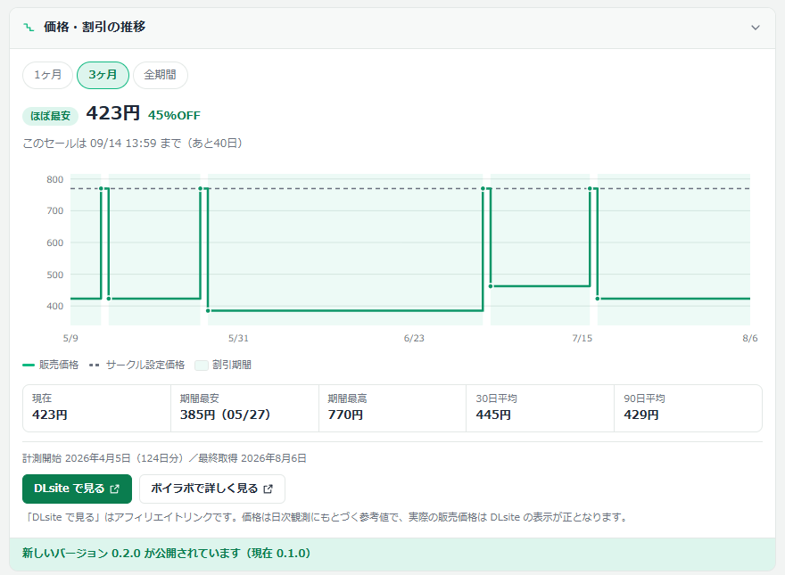
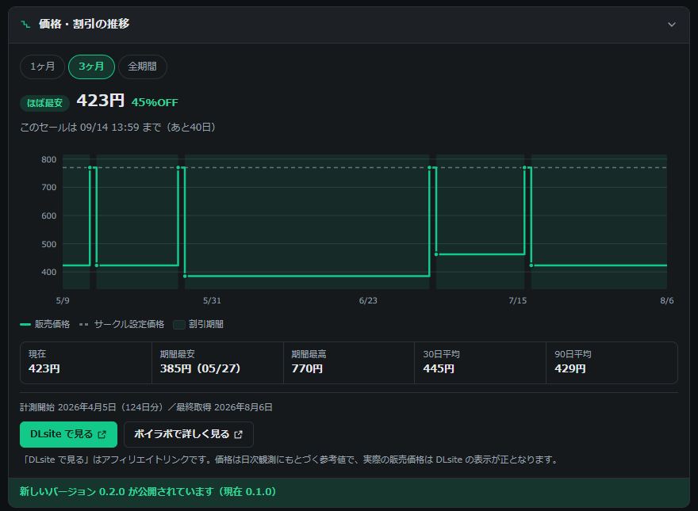

# DLsite Price Tracker

DLsite の作品ページに、**価格と割引の推移グラフ**を差し込むブラウザ拡張です。
「今が買い時なのか、もっと下がるのか」を、ページを離れずに判断できます。

Amazon における Keepa のような役割を、DLsite 同人音声に対して果たすことを目指しています。



<details>
<summary>ダークテーマ</summary>



</details>

---

## できること

| | 内容 |
|---|---|
| **階段グラフ** | 販売価格の推移を階段状に描画します。価格は「次に変わるまで同じ値が続く」量なので、点と点を直線で結ぶ折れ線にはしていません |
| **定価の重ね表示** | サークル設定価格を破線で重ねます。凡例クリックで消せます |
| **割引期間の可視化** | 割引中だった期間に薄い帯を敷きます |
| **買い時バッジ** | 「過去最安 / ほぼ最安 / 様子見 / 高値圏 / 値動きなし」を計測できた全期間から判定します |
| **セール終了日時** | 開催中のセールの終了日時と残り日数を表示します |
| **統計** | 現在 / 期間最安 / 期間最高 / 30日平均 / 90日平均 |
| **期間切替** | 1ヶ月 / 3ヶ月 / 全期間。切り替えても再通信しません |
| **折りたたみ** | 不要なときは畳めます。状態は次回も維持されます |

データは [ボイラボ（voicelabo.net）](https://voicelabo.net/) が毎日取得している
DLsite 作品 **77,000 件以上**の日次スナップショットから配信しています。

---

## インストール

> **この拡張は Chrome ウェブストアでは配布していません。**
> DLsite（成人向けを含むサイト）を対象とする拡張はストアの審査方針に抵触する可能性があるため、
> GitHub からダウンロードして「パッケージ化されていない拡張機能」として読み込む方式にしています。

### 手順（Chrome / Edge / Brave など Chromium 系）

1. **ダウンロード**
   [Releases](https://github.com/CureArcana/dlsite-price-tracker/releases/latest) から
   `dlsite-price-tracker-vX.Y.Z.zip` をダウンロードします。

2. **解凍**
   ZIP を解凍します。`manifest.json` が直下にあるフォルダができます。
   **このフォルダは消さないでください。** 拡張はここを読み続けます。
   （デスクトップ直下など、うっかり消さない場所に置くのがおすすめです）

3. **拡張機能ページを開く**
   アドレスバーに `chrome://extensions` と入力して開きます。
   Edge の場合は `edge://extensions` です。

4. **デベロッパーモードをオンにする**
   ページ右上のトグルスイッチです。

5. **「パッケージ化されていない拡張機能を読み込む」をクリック**
   左上に現れるボタンです。手順 2 で解凍した**フォルダ**（ZIP ファイルではありません）を選びます。

6. **DLsite の作品ページを開く**
   作品概要テーブルのすぐ上にパネルが表示されます。

### 更新のしかた

ストア配布ではないため**自動更新されません**。
新しいバージョンが出るとパネルの下部にお知らせが出るので、
そのとき Releases から新しい ZIP を落として、手順 2 のフォルダを中身ごと差し替えてください。
`chrome://extensions` で拡張の「更新」ボタン（またはリロードアイコン）を押すと反映されます。

設定（折りたたみ状態など）とキャッシュは拡張 ID に紐づいており、
`manifest.json` の `key` で ID を固定してあるため、入れ直しても引き継がれます。

### Firefox

現時点では未対応です。対応予定はあります。

---

## データについて — 正直に書いておきます

### 計測は 2026 年 4 月から

DLsite 作品の連続した日次記録は **2026 年 4 月上旬から**です。
それ以前の価格は分かりません。パネルには必ず「計測開始 ◯年◯月◯日（◯日分）」を表示しています。
Keepa のように何年分もある、という誤解を避けるためです。日が経つほど厚みは増していきます。

### 定価は一部が推定値

サークル設定価格（定価）の日次記録は 2026 年 7 月 4 日開始です。
それ以前の期間は「現在の定価」を横に伸ばして代用しているため、
その間にサークルが定価そのものを変更していた場合はずれます。

### 表示されない作品があります

ボイラボが取得対象にしている作品のみ表示されます。
発売直後の新作は数日で対象になります。対象外のときはその旨が表示されます。

### 価格は参考値です

日次スナップショットに基づく参考値です。**実際の販売価格は DLsite の表示が正**です。
購入前に必ず DLsite 上の価格をご確認ください。

---

## アフィリエイトについて

パネル内の **「DLsite で見る」ボタンは DLsite アフィリエイトリンク**です（`aid/voicelabo`）。
このボタン経由で購入された場合、ボイラボに紹介料が入ります。
リンクには `rel="sponsored"` を付与し、パネル内にも常時その旨を表示しています。

拡張は**ページ内に広告を出しません**。DLsite 側の既存リンクを書き換えることもしません。

---

## プライバシー

- 送信するのは **作品ID（`RJ` から始まる番号）だけ**です
- 閲覧履歴・アカウント情報・Cookie は一切送信しません
- アクセス解析やトラッキングを組み込んでいません
- 取得したデータは端末内（`chrome.storage.local`）に 6 時間キャッシュされます
- 権限は `storage` と、`voicelabo.net` / `api.github.com` への通信のみです
  （`api.github.com` は新バージョンの有無を 1 日 1 回確認するためだけに使います）

拡張は **DLsite に対してスクレイピングを一切行いません**。
価格データはすべてボイラボの API から取得しています。

---

## 開発

外部ライブラリへの依存はありません。グラフは素の JavaScript が生成する inline SVG です。
ビルド手順もありません。`src/` を直接編集して、`chrome://extensions` で拡張をリロードすれば反映されます。

### プレビューページ

DLsite を開かずに見た目を確認できます。

```bash
python dev/serve.py 8788
```

`http://localhost:8788/dev/preview.html` を開いてください。
DLsite の作品ページと同じ DOM 骨格を再現し、`src/` の実ファイルをそのまま読み込みます。
`chrome.*` はスタブに差し替わり、API の代わりに `dev/fixture-*.json` を返します。
「正常 / 値動きなし / 計測対象外 / 取得失敗」の 4 状態を切り替えて確認できます。

### 構成

```
manifest.json                  MV3。key で拡張IDを固定している
src/background/service-worker.js  API取得・キャッシュ・更新確認
src/content/work-page.js       パネルの組み立てと注入
src/content/panel.css          スタイル（ライト/ダーク両対応）
src/lib/dom.js                 DLsite のセレクタを集約。壊れたらここだけ直す
src/lib/format.js              整形・期間フィルタ・派生値
src/lib/chart.js               階段グラフ（inline SVG、依存ゼロ）
dev/preview.html               開発用プレビュー
dev/serve.py                   CORS付き静的サーバー
```

DLsite の DOM が変わって差し込み先を見失った場合、拡張は**何も表示せずに静かに終了**します。
DLsite のページを壊さないための設計です。

### API

```
GET  https://voicelabo.net/api/ext/price-history/{product_id}
POST https://voicelabo.net/api/ext/price-history/batch
```

価格が変わった日だけを返すラン・レングス圧縮形式のため、
124 日分の観測でもレスポンスは 1.3KB 程度です。

---

## ライセンス

MIT License — [LICENSE](LICENSE) を参照してください。

DLsite および DLsite のページデザインは株式会社エイシスの著作物です。
本拡張は同社とは関係のない第三者による非公式ツールです。

---

## English

A browser extension that injects a **price and discount history chart** into DLsite work pages —
roughly what Keepa does for Amazon, but for DLsite doujin audio works.

- **Not distributed via the Chrome Web Store.** Download from
  [Releases](https://github.com/CureArcana/dlsite-price-tracker/releases/latest),
  unzip, then load it as an unpacked extension from `chrome://extensions`
  with Developer mode enabled. It does not auto-update; the panel tells you when a new version ships.
- **Data starts in early April 2026.** Continuous daily records do not go back further than that.
  The panel always states the tracking start date rather than implying years of history.
- **Step chart, not a line chart.** A price holds its value until it changes, so interpolating
  between points would draw price movements that never happened.
- **The "DLsite で見る" button is an affiliate link** (`aid/voicelabo`, marked `rel="sponsored"`).
  No ads are injected, and existing DLsite links are never rewritten.
- **Only the product ID is transmitted.** No browsing history, no tracking, no analytics.
  The extension never scrapes DLsite; all data comes from the voicelabo.net API.
- **No dependencies, no build step.** The chart is inline SVG generated by plain JavaScript.

Licensed under MIT. Not affiliated with DLsite / EISYS, Inc.
